#  1 تصویری‌سازی داده‌ها

## 1.1 مقدمه

«یک نمودار ساده اطلاعات بیشتری را نسبت به هر وسیله دیگری در ذهن تحلیلگر فراهم می‌آورد.» - جان توکی

زبان R ابزارهای گوناگونی برای ساخت نمودار دارد، اما بسته ggplot2 یکی از زیباترین و پرکاربردترین آنهاست. ggplot2 دستور زبان گرافیک، یک مجموعه منسجم برای توصیف و ساخت نمودارها، را پیاده‌سازی می‌کند. به کمک ggplot2 می‌توانید با یادگیری یک مجموعه و به‌کارگیری آن در مکان‌های مختلف، کارهای بیشتر و سریع‌تری انجام دهید.


این فصل به شما آموزش می‌دهد که چگونه داده‌های خود را با استفاده از ggplot2 تصویرسازی کنید. با ساخت یک نمودار پراکنش ساده شروع می‌کنیم و از آن برای معرفی نگاشت‌های زیبایی‌شناختی و اشیاء هندسی - بلوک‌های سازنده اساسی ggplot2 - استفاده خواهیم کرد. سپس شما را با تصویرسازی توزیع های تک متغیره و همچنین تصویرسازی روابط بین دو یا چند متغیر آشنا خواهیم کرد. در نهایت با ذخیره‌سازی نمودارها و نکات عیب‌یابی بحث را پایان خواهیم داد.

### 1.1.1 پیش‌نیازها

این فصل بر روی ggplot2 تمرکز می‌کند که یکی از اعضای اصلی tidyverse است. برای دسترسی به مجموعه داده‌ها، صفحات راهنما و توابعی که در این فصل استفاده می‌شوند، با اجرای دستور زیر tidyverse را بارگذاری کنید:

```{r}
library(tidyverse)
#> ── Attaching core tidyverse packages ───────────────────── tidyverse 2.0.0 ──
#> ✔ dplyr     1.1.4     ✔ readr     2.1.5
#> ✔ forcats   1.0.1     ✔ stringr   1.6.0
#> ✔ ggplot2   4.0.0     ✔ tibble    3.3.0
#> ✔ lubridate 1.9.4     ✔ tidyr     1.3.1
#> ✔ purrr     1.2.0     
#> ── Conflicts ─────────────────────────────────────── tidyverse_conflicts() ──
#> ✖ dplyr::filter() masks stats::filter()
#> ✖ dplyr::lag()    masks stats::lag()
#> ℹ Use the conflicted package (<http://conflicted.r-lib.org/>) to force all conflicts to become errors
```

این یک خط کد مجموعه بسته‌های tidyverse را بارگذاری می‌کند؛ بسته‌هایی که تقریباً برای هر تحلیل داده‌ای مورد استفاده قرار خواهند گرفت. همچنین، خروجی دستور بالا به شما می‌گوید که کدام توابع از tidyverse در تناقض با توابع پایه‌ای R هستند (یا دیگر بسته‌هایی که ممکن است شما بارگذاری کرده باشید).

اگر این کد را اجرا کنید و پیام خطای `there is no package called 'tidyverse'` دریافت کردید، ابتدا باید آن را نصب کنید، سپس دوباره `()library` را اجرا کنید.
```{r}
install.packages("tidyverse")
library(tidyverse)
```

شما فقط باید یک بار یک بسته را نصب کنید، اما هر بار که یک محیط کاری جدید شروع می‌کنید باید آن را بارگذاری کنید.

علاوه بر tidyverse، ما همچنین از بسته palmerpenguins استفاده خواهیم کرد که شامل مجموعه داده `penguins` و دربردارنده اندازه‌های بدن پنگوئن‌های سه جزیره در مجمع‌الجزایر پالمر است و بسته ggthemes که مجموعه‌ای رنگارنگ از تم‌ها برای ggplot2 ارائه می‌دهد.

```{r}
library(palmerpenguins)
#> 
#> Attaching package: 'palmerpenguins'
#> The following objects are masked from 'package:datasets':
#> 
#>     penguins, penguins_raw
library(ggthemes)
```

## 2.1 اولین مراحل
آیا پنگوئن‌های با باله‌های بلندتر، وزن بیشتر یا کمتری نسبت به پنگوئن‌های با باله‌های کوتاه‌تر دارند؟ احتمالاً در حال حاضر یک پاسخ دارید، اما سعی کنید پاسخ خود را دقیق‌تر کنید. رابطه بین طول باله و وزن بدن چگونه است؟ مثبت؟ منفی؟ خطی؟ غیرخطی؟ آیا این رابطه بسته به نوع پنگوئن با هم فرق می‌کند؟ بسته به جزیره‌ای که پنگوئن در آن زندگی می‌کند چطور؟ بیایید نمودارهایی ایجاد کنیم که بتوانیم برای پاسخ به این سؤالات از آنها استفاده کنیم.

### 1.2.1 چارچوب داده `penguins`

می‌توانید پاسخ خود به این پرسش‌ها را با استفاده از چارچوب داده `penguins` موجود در palmerpenguins (یعنی `palmerpenguins::penguins`) آزمایش کنید. یک چارچوب داده مجموعه‌ای مستطیل شکل از متغیرها (در ستون‌ها) و مشاهدات (در سطرها) است. `penguins` شامل 344 مشاهده جمع‌آوری شده و در دسترس توسط دکتر کریستن گورمن و ایستگاه پالمر است.

برای روشن شدن بحث، به تعریف برخی اصطلاحات می‌پردازیم:
- **متغیر**، کمیت، کیفیت یا ویژگی‌ای است که می‌توانید آن را اندازه‌گیری کنید.
- **مقدار**، وضعیت یک متغیر هنگام اندازه‌گیری آن است. مقدار یک متغیر ممکن است از یک اندازه‌گیری به اندازه‌گیری دیگر تغییر کند.
- **مشاهده** مجموعه‌ای از اندازه‌گیری‌ها است که تحت شرایط یکسان انجام می‌شوند (معمولاً تمام اندازه‌گیری‌ها در یک مشاهده را همزمان و روی یک شیء انجام می‌دهید). یک مشاهده شامل چندین مقدار است، که هر کدام با یک متغیر متفاوت مرتبط است. ما گاهی اوقات به یک مشاهده به عنوان یک نقطه داده اشاره می‌کنیم.
- **داده‌های جدولی**، مجموعه‌ای از مقادیر هستند که مرتبط با یک متغیر و یک مشاهده می‌باشند. داده‌های جدولی مرتب هستند اگر هر مقدار در سلول خود، هر متغیر در ستون خود و هر مشاهده در سطر خود قرار گرفته باشد.

در این زمینه، یک متغیر مربوط به یک ویژگی از تمام پنگوئن‌ها است و یک مشاهده به تمام ویژگی‌های یک پنگوئن واحد مربوط می‌شود.

نام مجموعه داده را در کنسول تایپ کنید و R پیش‌نمایشی از آن را چاپ خواهد کرد. توجه داشته باشید که در بالای این پیش‌نمایش `tibble` نوشته شده است. در tidyverse از چارچوب داده‌های خاصی استفاده می‌کینم که **tibbles** نامیده می‌شوند و به زودی درباره آن بیشتر خواهید آموخت.

```{r}
penguins
#> # A tibble: 344 × 8
#>   species island    bill_length_mm bill_depth_mm flipper_length_mm
#>   <fct>   <fct>              <dbl>         <dbl>             <int>
#> 1 Adelie  Torgersen           39.1          18.7               181
#> 2 Adelie  Torgersen           39.5          17.4               186
#> 3 Adelie  Torgersen           40.3          18                 195
#> 4 Adelie  Torgersen           NA            NA                  NA
#> 5 Adelie  Torgersen           36.7          19.3               193
#> 6 Adelie  Torgersen           39.3          20.6               190
#> # ℹ 338 more rows
#> # ℹ 3 more variables: body_mass_g <int>, sex <fct>, year <int>
```

این چارچوب داده شامل 8 ستون است. روش دیگر نمایش این داده‌ها استفاده از تابع `()glimpse` است به طوری که می‌توانید همه‌ی متغیرها و چند مشاهده نخست را ببینید. یا اگر از Rstudio استفاده می‌کنید، با اجرای `View(penguins)` یک نمایشگر تعاملی از داده‌ها باز می‌شود. 

از جمله متغیرهای `penguins` می‌توان به موارد زیر اشاره کرد:

1. `species`: گونه پنگوئن (Adelie، Chinstrap یا Gentoo)
2. `flipper_length_mm`: طول یک باله پنگوئن (میلی‌متر)
3. `body_mass_g`: وزن بدن یک پنگوئن (گرم)

برای اطلاعات بشتر درباره `penguins` با اجرای دستور `penguins?` صفحه راهنمای آن را باز کنید.

### 2.2.1 هدف نهایی

هدف نهایی ما بازآفرینی نمودار زیر است که رابطه بین طول باله و وزن بدن این پنگوئن‌ها را با در نظر گرفتن گونه‌ی پنگوئن‌ها نشان می‌دهد.


### 3.2.1 ساخت یک ggplot

بیایید گام به گام این نمودار را بسازیم.

در ggplot2، ساخت یک نمودار را با `()ggplot` شروع می‌کنید و یک شئ نمودار را تعریف و سپس لایه‌هایی به آن اضافه می‌کنید. نخستین آرگومان `()ggplot` مجموعه داده مورد استفاده برای نمودار است پس `ggplot(data = penguins)` یک نمودار خالی ایجاد می‌کند که برای نمایش داده‌های `penguins` آماده شده است، اما چون هنوز به آن نگفته‌ایم که چگونه آن را تصویرسازی کند، یک صفحه خالی نمایش می‌دهد.  این یک نمودار خیلی هیجان‌انگیز نیست، اما می‌توانید آن را مانند یک بوم خالی در نظر بگیرید که لایه‌های باقی‌مانده نمودار خود را روی آن نقاشی خواهید کرد.

```{r}
ggplot(data = penguins)
```


در مرحله بعد، باید به `()ggplot` بگوییم که اطلاعات حاصل از داده‌های ما چگونه به صورت بصری نمایش داده شوند. آرگومان `mapping` از تابع `()ggplot` تعریف می‌کند که چگونه متغیرهای مجموعه داده به صورت ویژگی‌های بصری (**زیبایی‌شناسی**) از نمودار نگاشته شوند. آرگومان `mapping` همیشه در تایع `()aes` تعریف می‌شود و آرگومان‌های `x` و `y` از `()aes` مشخص می‌کنند که کدام متغیرها به محورهای x و y نگاشته شوند. اکنون، ما فقط طول باله را به محور x و وزن بدن را به محور y نگاشت خواهیم کرد. ggplot2 به دنبال متغیرهای نگاشت‌شده در آرگومان `data` می‌گردد که در این مورد، `penguins` هستند.

نمودار زیر نتیجه اضافه کردن این نگاشت‌ها را نشان می‌دهد.

```{r}
ggplot(
  data = penguins,
  mapping = aes(x = flipper_length_mm, y = body_mass_g)
)
```


 نمودار خالی بالا اکنون ساختار بیشتری دارد - واضح است که کجا طول باله‌ها (روی محور x) و کجا وزن‌های بدن پنگوئن‌ها (روی محور y) نمایش داده خواهد شد. اما خود داده‌ها هنوز در نمودار قرار نگرفته‌اند. دلیل این امر این است که ما هنوز در کد خود بیان نکرده‌ایم که چگونه مشاهدات از چارچوب داده‌ها بر روی نمودار نمایش داده شوند.

 برای انجام این کار باید یک **geom** تعریف کنیم: شیء هندسی که یک نمودار از آن برای نمایش داده‌ها استفاده می‌کند. این اشیاء هندسی در ggplot2 با توابعی که با `_geom` شروع می‌شوند، در دسترس قرار گرفته‌اند. اغلب افراد نمودارها را با نوع geom مورد استفاده در نمودار توصیف می‌کنند. به عنوان مثال، نمودارهای میله‌ای از geomهای میله‌ای (`()geom_bar`)، نمودارهای خطی از geomهای خطی (`()geom_line`)، نمودارهای جعبه‌ای از geomهای جعبه‌ای (`()geom_boxplot`)، نمودارهای پراکنش از geomهای نقطه‌ای (`()geom_point`) استفاده می‌کنند و غیره.

 تابع `()geom_point` یک لایه از نقاط را به نمودار شما اضافه می‌کند که یک نمودار پراکنش ایجاد می‌کند. ggplot2 با توابع geom زیادی ارائه می‌شود که هر کدام نوع متفاوتی از لایه را به نمودار اضافه می‌کنند. در طول کتاب، به ویژه در فصل 9، با تعداد زیادی geom آشنا خواهید شد.

```{r}
ggplot(
  data = penguins,
  mapping = aes(x = flipper_length_mm, y = body_mass_g)
) +
  geom_point()
#> Warning: Removed 2 rows containing missing values or values outside the scale range
#> (`geom_point()`).
```


اکنون این نمودار شبیه به چیزی است که می‌توانیم آن را یک «نمودار پراکنش» در نظر بگیریم. این نمودار هنوز با نمودار «هدف نهایی» ما مطابقت ندارد، اما با استفاده از این نمودار می‌توانیم به سوالی که انگیزه کاوش ما بود پاسخ دهیم: «رابطه بین طول باله و وزن بدن چگونه است؟» به نظر می‌رسد این رابطه مثبت است (با افزایش طول باله، وزن بدن نیز افزایش می‌یابد)، نسبتاً خطی است (نقاط به جای منحنی، دور یک خط پخش شده‌اند) و نسبتاً قوی است (پراکندگی زیادی در اطراف چنین خطی وجود ندارد). پنگوئن‌هایی که باله‌های بلندتری دارند، عموماً از نظر وزن بدن نیز بزرگتر هستند.

قبل از اینکه لایه‌های بیشتری به این نمودار اضافه کنیم، بیایید لحظه‌ای مکث کنیم و پیام هشداری که دریافت کردیم را مرور کنیم:

> دو ردیف حاوی مقادیر گمشده حذف شدند (`()geom_point`).

ما این پیام را می‌بینیم زیرا دو پنگوئن در مجموعه داده‌های ما وجود دارند که مقادیر وزن بدن و/یا طول باله آنها گمشده است و ggplot2 هیچ راهی برای نمایش آنها در نمودار بدون هر دوی این مقادیر ندارد. ggplot2 مانند R، از این فلسفه پیروی می‌کند که وجود مقادیر گمشده در داده همیشه بایستی هشدار داده شوند. این نوع هشدار احتمالاً یکی از رایج‌ترین انواع هشدارهایی است که هنگام کار با داده‌های واقعی خواهید دید - مقادیر گمشده یک مسئله بسیار رایج هستند و در طول کتاب، به ویژه در فصل ۱۸، درباره آنها بیشتر خواهید آموخت. برای نمودارهای باقی‌مانده در این فصل، این هشدار را حذف می‌کنیم تا در کنار هر نموداری که رسم می‌کنیم چاپ نشود.


## 4.2.1 افزودن aesthetics و لایه‌ها
نمودارهای پراکنش برای نمایش رابطه بین دو متغیر عددی مفید هستند، اما همیشه ایده خوبی است که نسبت به هرگونه رابطه ظاهری بین دو متغیر شک داشته باشید و بپرسید که آیا متغیرهای دیگری وجود دارند که ماهیت این رابطه ظاهری را توضیح یا تغییر می‌دهند. به عنوان مثال، آیا رابطه بین طول باله و وزن بدن در گونه‌های مختلف متفاوت است؟ بیایید گونه‌ها را در نمودار خود بگنجانیم و ببینیم آیا این کار بینش بیشتری در مورد رابطه ظاهری بین این متغیرها نشان می‌دهد یا خیر. ما این کار را با نمایش گونه‌ها با نقاط رنگی مختلف انجام خواهیم داد.

برای رسیدن به این هدف، نیاز داریم که aesthetics و geom کدام یک را اصلاح کنیم؟ اگر حدس شما در نگاشت aesthetics درون تابع `()aes` است، پس شما اکنون با ساخت تصویرسازی داده‌ها در ggplot2 آشنا هستید! و اگر نه، نگران نباشید. سراسر کتاب شما ggplotهای بسیار بیشتری خواهید ساخت و فرصت‌های زیادی در زمان ساحت آنها برای آزمایش شهود خود خواهید داشت.


```{r}
ggplot(
  data = penguins,
  mapping = aes(x = flipper_length_mm, y = body_mass_g, color = species)
) +
  geom_point()
```


زمانی که یک متغیر رسته‌ای به رنگ نگاشت می‌شود، ggplot2 به طور خودکار یک مقیاس رنگ منحصر به فرد به هر مقدار منحصر به فرد از متغیر اختصاص می‌دهد (هر یک از سه گونه)، یک فرآیندی که **مقیاس‌بندی** نامیده می‌شود. ggplot2 همچنین یک راهنما اضافه می‌کند که توضیح می‌دهد کدام مقادیر با کدام سطوح مطابقت دارند.

حالا بیایید یک لایه دیگر اضافه کنیم: یک منحنی هموار که رابطه بین وزن بدن و طول باله را نشان می‌دهد. قبل از ادامه دادن، با مراجعه به کد بالا در مورد چگونگی اضافه کردن این لایه به نمودار موجود خود فکر کنید.

از آنجایی که این یک شیء هندسی جدید است که داده‌های ما را نشان می‌دهد، یک geom جدید به عنوان یک لایه در بالای geom نقطه‌ای خود اضافه خواهیم کرد: ‍‍`()geom_smooth`. مشخص خواهیم کرد که می‌خواهیم خط بهترین برازش را بر اساس یک مدل خطی با `method = "lm"` رسم کنیم.

```{r}
ggplot(
  data = penguins,
  mapping = aes(x = flipper_length_mm, y = body_mass_g, color = species)
) +
  geom_point() +
  geom_smooth(method = "lm")
```


با موفقیت خط‌ها را اضافه کرده‌ایم، اما این نمودار شبیه به نمودار بخش 2.2.1 نیست که در آن فقط یک خط برای کل مجموعه داده وجود دارد، برخلاف خطوط جداگانه برای هر یک از گونه‌های پنگوئن.

وقتی نگاشت‌های aesthetic در `()ggplot` تعریف می‌شوند، در سطح سراسری، به هر یک از لایه‌های geom بعدی نمودار منتقل می‌شوند. با این حال، هر تابع geom در ggplot2 می‌تواند یک آرگومان `mapping` نیز دریافت کند، که امکان نگاشت‌های aesthetic را در سطح خود فراهم می‌کند که به نگاشت‌های به ارث‌رسیده از سطح قبلی، اضافه می‌شوند. از آنجایی که می‌خواهیم نقاط بر اساس گونه‌ها رنگ‌آمیزی شوند اما نمی‌خواهیم خطوط برای آنها از هم جدا شوند، باید فقط برای `()geom_point` از `color = species` استفاده کنیم.
‍‍
```{r}
ggplot(
  data = penguins,
  mapping = aes(x = flipper_length_mm, y = body_mass_g)
) +
  geom_point(mapping = aes(color = species)) +
  geom_smooth(method = "lm")
```


بسیار عالی! اکنون ما چیزی داریم که به هدف نهایی ما بسیار زیاد شبیه است، اگرچه هنوز کامل نیست. ما هنوز باید از اشکال مختلف برای هر گونه‌ی پنگوئن استفاده کنیم و برچسب‌ها را بهبود بخشیم.

به طور کلی ایده خوبی نیست که اطلاعات را فقط با استفاده از رنگ‌ها در یک نمودار نمایش دهید، زیرا افراد به دلیل کوررنگی یا سایر تفاوت‌های بینایی رنگ، رنگ‌ها را متفاوت درک می‌کنند. بنابراین، علاوه بر رنگ، می‌توانیم گونه‌ها را بر اساس  اشکال با اختصاص `species` به آرگومان `shape` نیز ترسیم کنیم.

```{r}
ggplot(
  data = penguins,
  mapping = aes(x = flipper_length_mm, y = body_mass_g)
) +
  geom_point(mapping = aes(color = species, shape = species)) +
  geom_smooth(method = "lm")
```


توجه کنید که راهنمای نمودار به طور خودکار به‌روزرسانی شده است تا اشکال مختلف نقاط را نیز نشان دهد.

در پایان، می‌توانیم برچسب‌های نمودار خود را با استفاده از تابع `()labs` در یک لایه جدید بهبود بخشیم. برخی از آرگومان‌های تابع labs() ممکن است واضح باشند: `title` یک عنوان  و `subtitle` یک زیر عنوان به نمودار اضافه می‌کند. سایر آرگومان‌ها با نگاشت‌های خود مطابقت دارند، x برچسب محور x، `y` برچسب محور y و `color` و `shape` برچسب راهنما را تعریف می‌کنند. علاوه بر این، می‌توانیم طیف رنگ را با استفاده از تابع `()scale_color_colorblind` از بسته ggthemes برای محافظت در برابر کوررنگی بهبود بخشیم.

```{r}
ggplot(
  data = penguins,
  mapping = aes(x = flipper_length_mm, y = body_mass_g)
) +
  geom_point(aes(color = species, shape = species)) +
  geom_smooth(method = "lm") +
  labs(
    title = "Body mass and flipper length",
    subtitle = "Dimensions for Adelie, Chinstrap, and Gentoo Penguins",
    x = "Flipper length (mm)", y = "Body mass (g)",
    color = "Species", shape = "Species"
  ) +
  scale_color_colorblind()
```


در پایان نموداری ترسیم کرده‌ایم که با «هدف نهایی» ما مطابقت دارد!

### 5.2.1 تمرین‌ها
1. چند سطر در مجموعه داده `penguins` وجود دارد؟ در مورد ستون‌ها چطور؟
2. متغیر `bill_depth_mm` در چارچوب داده `penguins` چه چیزی را توصیف می‌کند؟ برای فهمیدن آن، راهنمای `penguins?` را بخوانید.
3. یک نمودار پراکنش از `bill_depth_mm` در برابر `bill_length_mm` ایجاد کنید.  یعنی، یک نمودار پراکنش با `bill_depth_mm` روی محور y و `bill_length_mm` روی محور x رسم کنید. رابطه بین این دو متغیر را شرح دهید.
4. اگر نمودار پراکندگی `species` در مقابل `bill_depth_mm` را رسم کنید چه اتفاقی می‌افتد؟ چه چیزی می‌تواند انتخاب بهتری برای geom باشد؟
5. چرا کد زیر خطا می‌دهد و چگونه می‌توان آن را برطرف کرد؟
```{r}
ggplot(data = penguins) + 
  geom_point()
```
6. آرگومان `na.rm` در تابع `()geom_point` چه کاری انجام می‌دهد؟ مقدار پیش‌فرض آرگومان چیست؟ یک نمودار پراکنش ایجاد کنید که در آن با موفقیت از این آرگومان استفاده کرده باشید و مقدار آن را `TRUE` قرار دهید.
7. عنوان زیر را به نموداری که در تمرین قبلی ایجاد کردید اضافه کنید: «داده‌ها از بسته palmerpenguins می‌آیند.» راهنمایی: نگاهی به راهنمای مربوط به تابع `()labs` بیندازید.
8. نمودار زیر را دوباره ایجاد کنید. متغیر `bill_depth_mm` باید به چه صورتی ترسیم شود؟ آیا باید در درون تابع `ggplot` نگاشته شود یا در درون توابع `_geom`؟

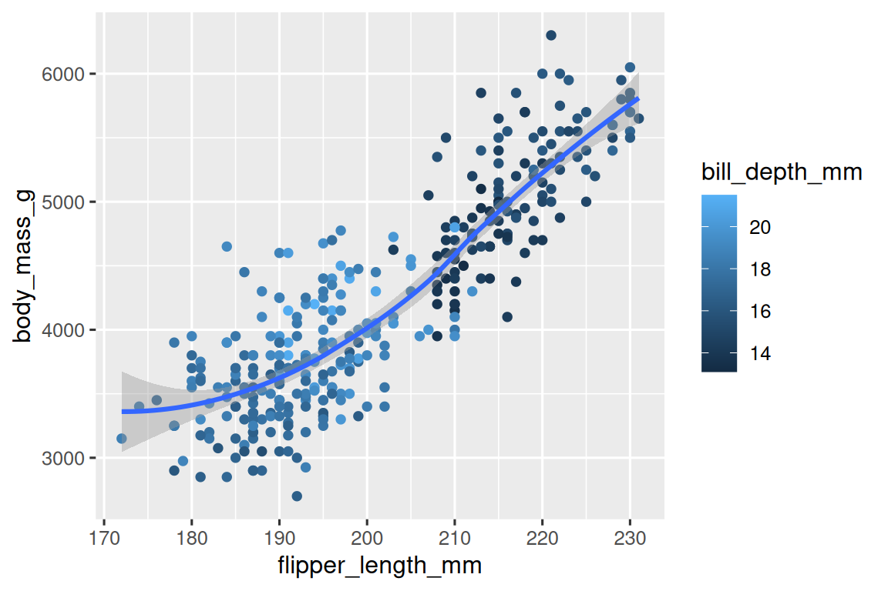

9. این کد را در ذهن خود اجرا کنید و پیش‌بینی کنید که خروجی چگونه خواهد بود. سپس، کد را در R اجرا کنید و پیش‌بینی‌های خود را بررسی کنید.
```{r}
ggplot(
  data = penguins,
  mapping = aes(x = flipper_length_mm, y = body_mass_g, color = island)
) +
  geom_point() +
  geom_smooth(se = FALSE)
```
10. آیا این دو نمودار متفاوت به نظر خواهند رسید؟ چرا/چرا نه؟
```{r}
ggplot(
  data = penguins,
  mapping = aes(x = flipper_length_mm, y = body_mass_g)
) +
  geom_point() +
  geom_smooth()

ggplot() +
  geom_point(
    data = penguins,
    mapping = aes(x = flipper_length_mm, y = body_mass_g)
  ) +
  geom_smooth(
    data = penguins,
    mapping = aes(x = flipper_length_mm, y = body_mass_g)
  )
```

## 3.1 فراخوانی‌های ggplot2

با گذر از این بخش‌های مقدماتی، به بیان مختصرتری از کد ggplot2 خواهیم پرداخت. تاکنون بسیار صریح بوده‌ایم که هنگام یادگیری مفید است:
```{r}
ggplot(
  data = penguins,
  mapping = aes(x = flipper_length_mm, y = body_mass_g)
) +
  geom_point()
```

معمولاً، یک یا دو آرگومان اول یک تابع آنقدر مهم هستند که باید آنها را از حفظ بدانید. دو آرگومان نخست تابع `()ggplot` آرگومان‌های `data` و `mapping` هستند، در ادامه کتاب، ما این نام‌ها را ارائه نخواهیم داد. این کار باعث صرفه‌جویی در تایپ می‌شود و با کاهش مقدار متن اضافی، مشاهده تفاوت بین نمودارها را آسان‌تر می‌کند. این یک نگرانی واقعاً مهم برنامه‌نویسی است که در فصل ۲۵ به آن باز خواهیم گشت.

بازنویسی نمودار قبلی به طور خلاصه‌تر، نتیجه‌ی زیر را حاصل می‌دهد:
```{r}
ggplot(penguins, aes(x = flipper_length_mm, y = body_mass_g)) + 
  geom_point()
```

در آینده، شما همچنین درباره پایپ `<|` بیشتر یاد خواهید گرفت که به شما امکان می‌دهد آن نمودار را به صورت زیر ایجاد کنید:
‍‍
```{r}
penguins |> 
  ggplot(aes(x = flipper_length_mm, y = body_mass_g)) + 
  geom_point()
```

## 4.1 تصویرسازی توزیع‌ها

نحوه‌ی نمایش توزیع یک متغیر به نوع متغیر بستگی دارد: رسته‌ای یا عددی.

### 1.4.1 متغیر رسته‌ای

یک متغیر رسته‌ای است اگر فقط بتواند تنها یک مقدار از مجموعه کوچک از مقادیر را بپذیرد. برای بررسی توزیع یک متغیر رسته‌ای، می‌توانید از نمودار میله‌ای استفاده کنید. ارتفاع میله‌ها نشان می‌دهد که با هر مقدار ‍‍`x` چند مشاهده رخ داده است.

```{r}
ggplot(penguins, aes(x = species)) +
  geom_bar()
```

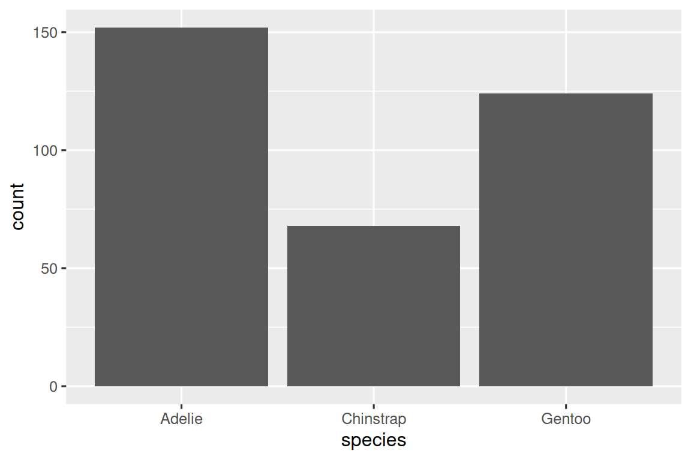

در نمودارهای میله‌ای از متغیرهای رسته‌ای با سطوح غیرمرتب، مانند `species` در مجموعه داده پنگوئن در بالا، اغلب ترجیح داده می‌شود که میله‌ها بر اساس فراوانی‌هایشان مرتب شوند.  انجام این کار مستلزم تبدیل متغیر به یک عامل (نحوه مدیریت داده‌های رسته‌ای توسط R) و سپس مرتب‌سازی مجدد سطوح آن عامل است.

```{r}
ggplot(penguins, aes(x = fct_infreq(species))) +
  geom_bar()
```

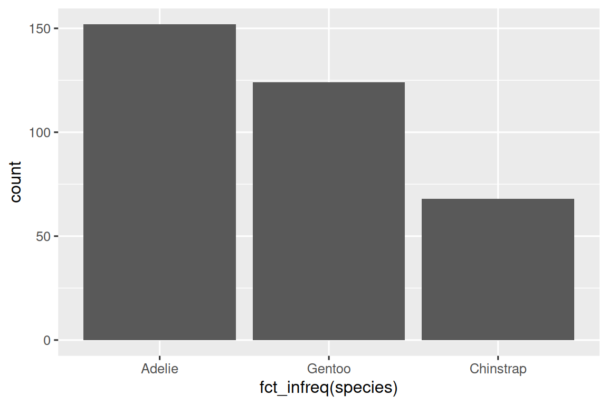

در فصل ۱۶ درباره عامل‌ها و توابع مربوط به آنها (مانند `()fct_infreq` که در بالا نشان داده شده است) بیشتر خواهید آموخت.

### 2.4.1  متغیر عددی

یک متغیر، عددی (یا کمی) است اگر بتواند طیف وسیعی از مقادیر عددی را بپذیرد، و جمع، تفریق یا میانگین‌گیری از آن مقادیر معقول باشد. متغیرهای عددی می‌توانند پیوسته یا گسسته باشند.

یکی از روش‌های رایج برای نمایش توزیع متغیرهای پیوسته، نمودار بافت‌نگار است.

```{r}
ggplot(penguins, aes(x = body_mass_g)) +
  geom_histogram(binwidth = 200)
```

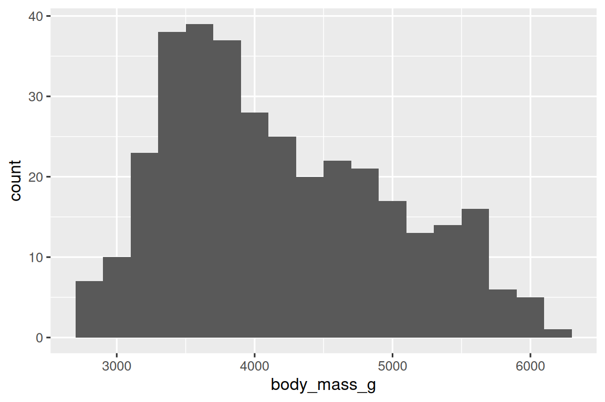

یک بافت‌نگار، محور x را به دسته‌هایی با فاصله مساوی تقسیم می‌کند و ارتفاع یک میله تعداد مشاهداتی که در هر دسته قرار می‌گیرند را نشان می‌دهد. در نمودار بالا، بلندترین میله نشان می‌دهد که ۳۹ مشاهده دارای مقدار `body_mass_g` بین ۳۵۰۰ تا ۳۷۰۰ گرم هستند که لبه‌های چپ و راست میله هستند. 

شما می‌توانید عرض دسته‌ها را در یک بافت‌نگار با آرگومان binwidth تنظیم کنید، که بر حسب واحد متغیر x اندازه‌گیری می‌شود. هنگام کار با بافت‌نگارها، همیشه باید انواع مختلف عرض دسته‌ها را بررسی کنید، زیرا عرض‌های مختلف می‌توانند الگوهای متفاوتی را نشان دهند.  در نمودارهای زیر، عرض دسته‌ی 20 بسیار باریک است و منجر به ایجاد میله‌های زیاد می‌شود که تعیین شکل توزیع را دشوار می‌کند. به طور مشابه، عرض دسته برابر با 2,000 نیز بسیار زیاد است و منجر به قرار گرفتن تمام داده‌ها در تنها سه میله می‌شود و همچنین تعیین شکل توزیع را دشوار می‌کند. عرض دسته برابر با 200 تعادل معقولی را فراهم می‌کند.

```{r}
ggplot(penguins, aes(x = body_mass_g)) +
  geom_histogram(binwidth = 20)
ggplot(penguins, aes(x = body_mass_g)) +
  geom_histogram(binwidth = 2000)
```

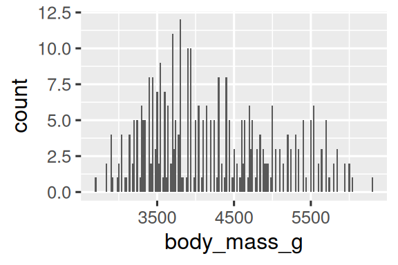 | 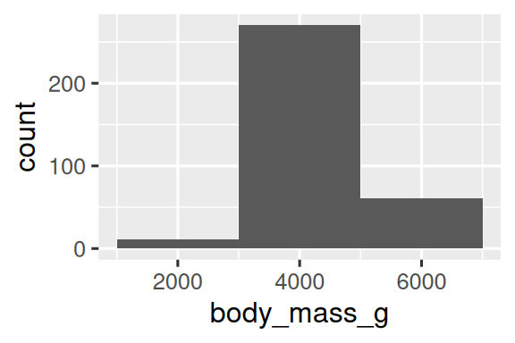

روش دیگر برای نمایش بصری توزیع متغیرهای عددی، نمودار چگالی است. نمودار چگالی، نسخه‌ی هموارشده‌ی بافت‌نگار و یک جایگزین کاربردی است، به خصوص برای داده‌های پیوسته‌ای که از یک توزیع هموار زیربنایی حاصل می‌شوند. ما به نحوه تخمین چگالی توسط `()geom_density` نمی‌پردازیم (می‌توانید اطلاعات بیشتر را در راهنمای تابع بخوانید)، اما بیایید نحوه ترسیم منحنی چگالی را با یک قیاس توضیح دهیم. یک بافت‌نگار ساخته‌شده از بلوک‌های چوبی را تصور کنید. سپس، تصور کنید که یک رشته اسپاگتی پخته‌شده را روی آن می‌اندازید. شکلی که اسپاگتی روی بلوک‌ها قرار می‌گیرد را می‌توان به عنوان شکل منحنی چگالی در نظر گرفت. این نمودار جزئیات کمتری نسبت به بافت‌نگار نشان می‌دهد، اما می‌تواند تشخیص سریع شکل توزیع، به ویژه در رابطه با مدها و چولگی، را آسان‌تر کند.

```{r}
ggplot(penguins, aes(x = body_mass_g)) +
  geom_density()
#> Warning: Removed 2 rows containing non-finite outside the scale range
#> (`stat_density()`).
```

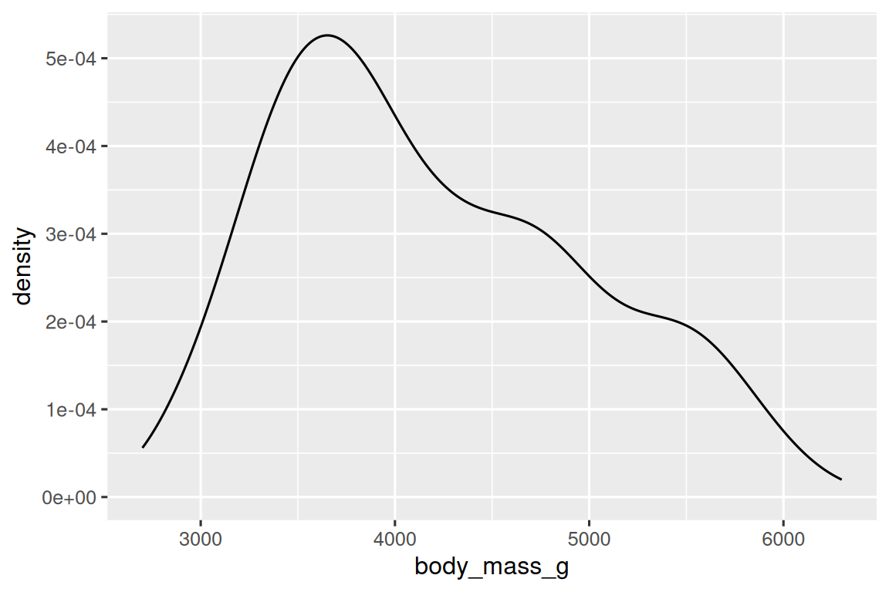


### 3.4.1 تمرین‌ها
1. یک نمودار میله‌ای از `species` از مجموعه داده `penguins` رسم کنید که در آن `species` را به عنوان ورودی آرگومان ‍‍`y` اختصاص دهید. این نمودار چه تفاوتی دارد؟
2. دو نمودار زیر چه تفاوتی با هم دارند؟ کدام یک از دو آرگومان ورودی، `color` یا `fill`، برای تغییر رنگ میله‌ها مفیدتر است؟
```{r}
ggplot(penguins, aes(x = species)) +
  geom_bar(color = "red")

ggplot(penguins, aes(x = species)) +
  geom_bar(fill = "red")
```
3. آرگومان `bins` در تابع `()geom_histogram` چه کاری انجام می‌دهد؟
4. یک بافت‌نگار از متغیر `carat` در مجموعه داده `diamonds` که هنگام بارگذاری بسته tidyverse در دسترس است، ایجاد کنید. با عرض دسته‌های مختلف آزمایش کنید. کدام عرض دسته جالب‌ترین الگوها را نشان می‌دهد؟

## 5.1 تصویرسازی رابطه‌ها

برای تصویرسازی یک رابطه، باید حداقل دو متغیر را به جنبه‌های تصویری یک نمودار نگاشت کنیم. در بخش‌های بعدی، با نمودارهای رایج برای تصویرسازی روابط بین دو یا چند متغیر و  geomهای مورد استفاده برای ایجاد آنها آشنا خواهید شد.

### 1.5.1 یک متغیر عددی و یک متغیر رسته‌ای

برای نمایش رابطه بین یک متغیر عددی و یک متغیر رسته‌ای، می‌توانیم از نمودارهای جعبه‌ای کنار هم استفاده کنیم. **نمودار جعبه‌ای** نوعی خلاصه‌نویسی بصری برای معیارهای موقعیت (صدک‌ها) است که یک توزیع را توصیف می‌کنند. همچنین برای شناسایی داده‌های پرت بالقوه مفید است. همانطور که در شکل 1.1 نشان داده شده است، هر نمودار جعبه‌ای شامل موارد زیر است:

- جعبه‌ای که دامنه نیمه میانی داده‌ها را نشان می‌دهد، فاصله‌ای که به عنوان دامنه بین چارکی (IQR) شناخته می‌شود و از صدک 25ام توزیع تا صدک 75ام امتداد دارد. در وسط جعبه خطی وجود دارد که میانه، یعنی صدک 50ام توزیع را نشان می‌دهد. این سه خط درکی از پراکندگی توزیع و این که آیا توزیع نسبت به میانه متقارن یا به یک طرف چوله شده است به شما می‌دهند.
- نقاط مشاهداتی را نشان می‌دهند که بیش از ۱.۵ برابر IQR از هر لبه جعبه فاصله دارند. این نقاط دورافتاده غیرمعمول هستند، بنابراین به صورت جداگانه رسم می‌شوند.
- یک خط (یا خط باریک) که از هر دو انتهای جعبه امتداد می‌یابد و تا دورترین نقطه غیرپرت در توزیع کشیده می‌شود.


*شکل ۱.۱: نموداری که نحوه ایجاد یک نمودار جعبه‌ای را نشان می‌دهد.*

بیایید با استفاده از تابع `()geom_boxplot` نگاهی به توزیع وزن بدن بر اساس گونه‌های پنگوئن بیندازیم:
```{r}
ggplot(penguins, aes(x = species, y = body_mass_g)) +
  geom_boxplot()
```

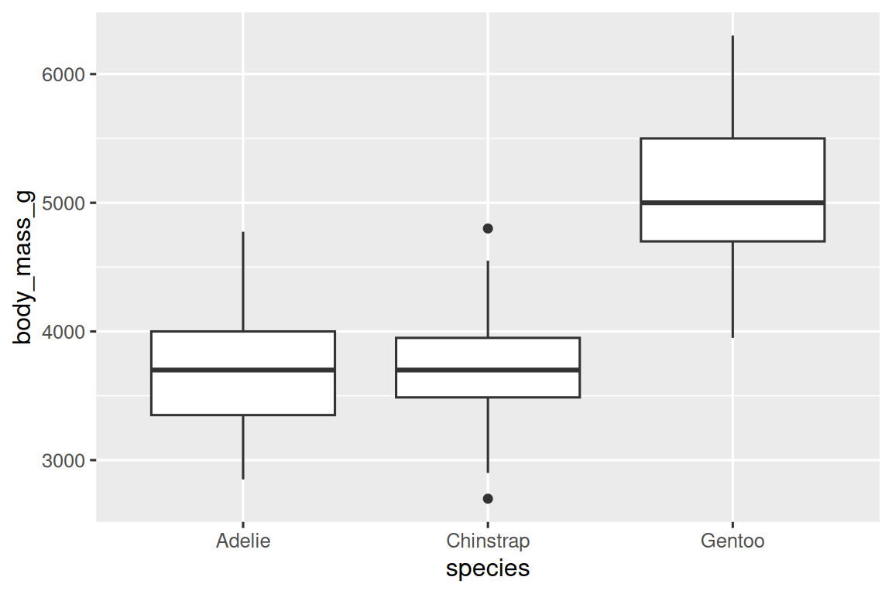

به عنوان یک روش جایگزین، می‌توانیم نمودارهای چگالی را با `()geom_density` رسم کنیم.

```{r}
ggplot(penguins, aes(x = body_mass_g, color = species)) +
  geom_density(linewidth = 0.75)
```

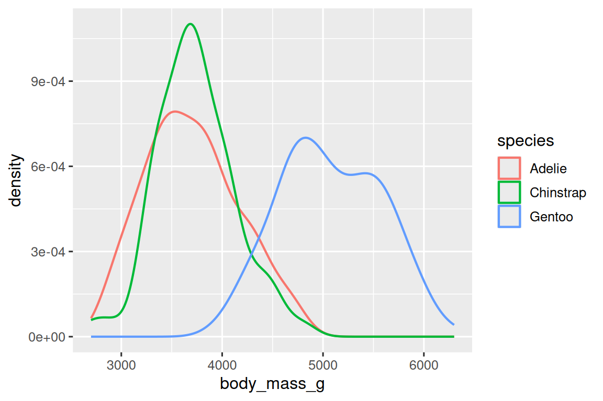

ما همچنین خطوط را با استفاده از آرگومان `linewidth` ضخیم‌تر کرده‌ایم تا آنها را کمی بیشتر در مقابل پس‌زمینه برجسته کنیم.

علاوه بر این، می‌توانیم `species` را به عنوان ورودی به هر دو آرگومان `color` و `fill` بدهیم و از آرگومان `alpha` برای افزودن میزان شفافیت به منحنی‌های چگالی پرشده استفاده کنیم. این آرگومان مقادیری بین ۰ (کاملاً شفاف) و ۱ (کاملاً مات) می‌گیرد. در نمودار زیر، روی ۰.۵ تنظیم شده است.

```{r}
ggplot(penguins, aes(x = body_mass_g, color = species, fill = species)) +
  geom_density(alpha = 0.5)
```

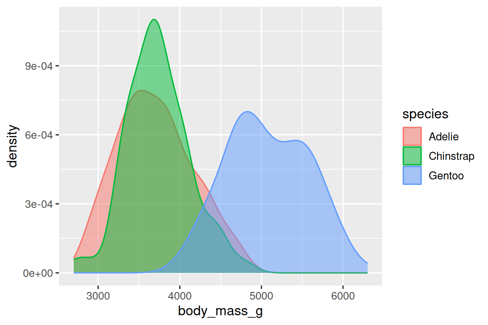

به اصطلاحاتی که اینجا به کار برده‌ایم توجه کنید:
- اگر بخواهیم ویژگی بصری نمایش داده‌شده توسط آن آرگومان بر اساس مقادیر آن متغیر تغییر کند، متغیرها را به عنوان ورودی به آن آرگومان اختصاص می‌دهیم.
- در غیر این صورت، مقدار آن آرگومان را به صورت یک عدد تعیین می‌کنیم.

### 2.5.1 دو متغیر رسته‌ای

می‌توانیم از نمودارهای میله‌ای پشته‌ای برای تصویرسازی رابطه بین دو متغیر رسته‌ای استفاده کنیم. برای مثال، دو نمودار میله‌ای پشته‌ای زیر، هر دو رابطه بین `island` و `species` یا به طور خاص، تصویر توزیع `species` در هر جزیره را نشان می‌دهند.

نمودار اول فراوانی هر گونه پنگوئن را در هر جزیره نشان می‌دهد. نمودار فراوانی‌ها نشان می‌دهد که تعداد مساوی از پنگوئن‌های آدلی در هر جزیره وجود دارد. اما ما درک خوبی از نسبت هر گونه در هر جزیره نداریم.

```{r}
ggplot(penguins, aes(x = island, fill = species)) +
  geom_bar()
```

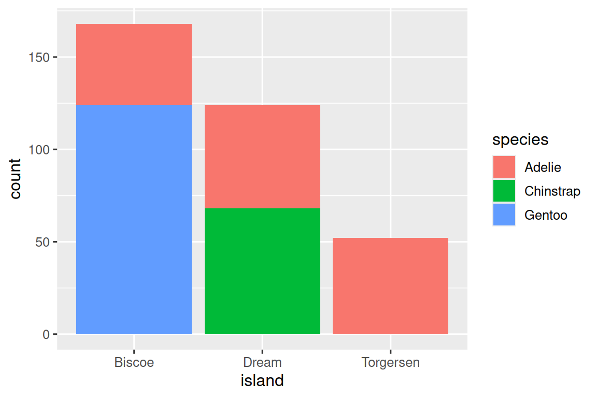

نمودار دوم، یک نمودار فراوانی نسبی است که با تنظیم `position = "fill"` در geom ایجاد شده است و برای مقایسه توزیع گونه‌ها در جزایر مفیدتر است زیرا تحت تأثیر تعداد نابرابر پنگوئن‌ها در سراسر جزایر قرار نمی‌گیرد. با استفاده از این نمودار می‌توانیم ببینیم که پنگوئن‌های جنتو همگی در جزیره بیسکو زندگی می‌کنند و تقریباً ۷۵٪ از پنگوئن‌های آن جزیره را تشکیل می‌دهند، پنگوئن‌های چین‌استرپ همگی در جزیره دریم زندگی می‌کنند و تقریباً ۵۰٪ از پنگوئن‌های آن جزیره را تشکیل می‌دهند و پنگوئن‌های آدلی در هر سه جزیره زندگی می‌کنند و تمام پنگوئن‌های تورگرسن را تشکیل می‌دهند.

```{r}
ggplot(penguins, aes(x = island, fill = species)) +
  geom_bar(position = "fill")
```


در ایجاد این نمودارهای میله‌ای، متغیری را که به صورت میله‌ای جدا می‌شود به آرگومان `x` و متغیری را که رنگ‌های داخل میله‌ها را تغییر می‌دهد به آرگومان `fill` اختصاص می‌دهیم. متأسفانه، ggplot2 به طور پیش‌فرض محور y را `"count"` نامگذاری می‌کند، اما این چیزی است که می‌توانیم با اضافه کردن یک لایه با استفاده از `()labs` که در آن برچسب محور y را ‍`"proportion"` مشخص می‌کنیم، حذف کنیم.

```{r}
ggplot(penguins, aes(x = island, fill = species)) +
  geom_bar(position = "fill") +
  labs(y = "proportion")
```

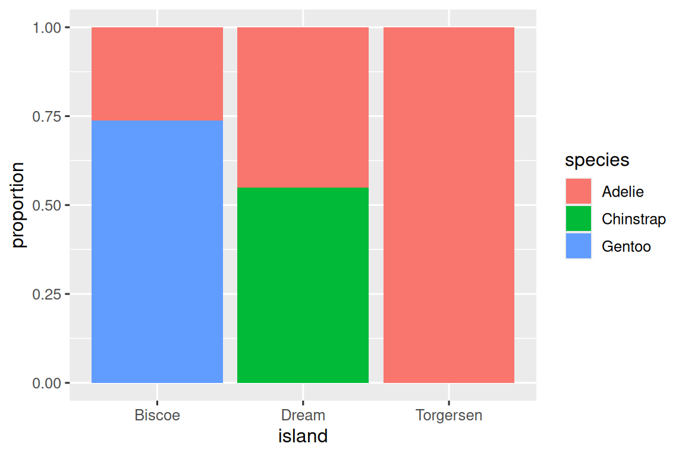


### 3.5.1 دو متغیر عددی

تا اینجا در مورد نمودارهای پراکنش (که با `()geom_point` ایجاد می‌شوند) و منحنی‌های هموار (که با `()geom_smooth` ایجاد می‌شوند) برای تصویرسازی رابطه بین دو متغیر عددی یاد گرفته‌اید. نمودار پراکنش احتمالاً رایج‌ترین نمودار مورد استفاده برای تصویرسازی رابطه بین دو متغیر عددی است.

```{r}
ggplot(penguins, aes(x = flipper_length_mm, y = body_mass_g)) +
  geom_point()
```


### 4.5.1 سه یا چند متغیر

همانطور که در بخش 4.2.1 دیدیم، می‌توانیم متغیرهای بیشتری را با اختصاص آنها به آرگومان‌های اضافی، در یک نمودار بگنجانیم. برای مثال، در نمودار پراکنش زیر، رنگ نقاط نشان‌دهنده گونه‌ها و شکل نقاط نشان‌دهنده جزایر است.
```{r}
ggplot(penguins, aes(x = flipper_length_mm, y = body_mass_g)) +
  geom_point(aes(color = species, shape = island))
```

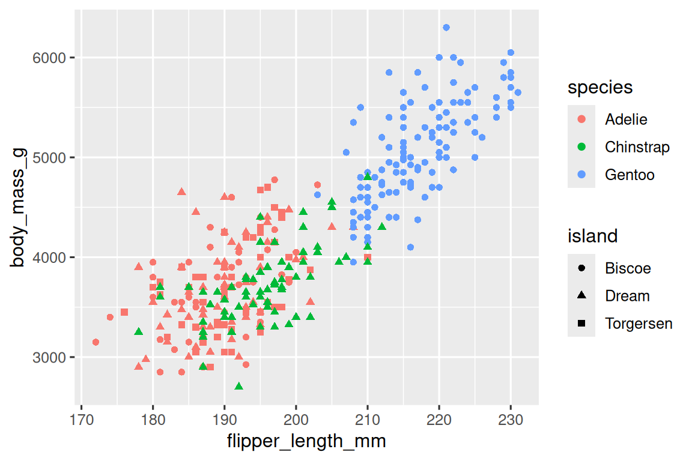

با این حال، اضافه کردن آرگومان‌های بیش از حد به یک نمودار، آن را شلوغ و فهم آن را دشوار می‌کند. روش دیگر، که به ویژه برای متغیرهای رسته‌ای مفید است، تقسیم نمودار به **وجه‌ها** (facets) است، زیرنمودارهایی که هر کدام یک زیرمجموعه از داده‌ها را نمایش می‌دهند.

برای وجه‌بندی نمودار خود توسط یک متغیر واحد، از `()facet_wrap` استفاده کنید. اولین آرگومان `()facet_wrap` یک فرمول است که شما آن را با `~` و به دنبال آن نام متغیر را ایجاد می‌کنید. متغیری که در `()facet_wrap` تعیین می‌کنید باید از نوع رسته‌ای باشد.

```{r}
ggplot(penguins, aes(x = flipper_length_mm, y = body_mass_g)) +
  geom_point(aes(color = species, shape = species)) +
  facet_wrap(~island)
```

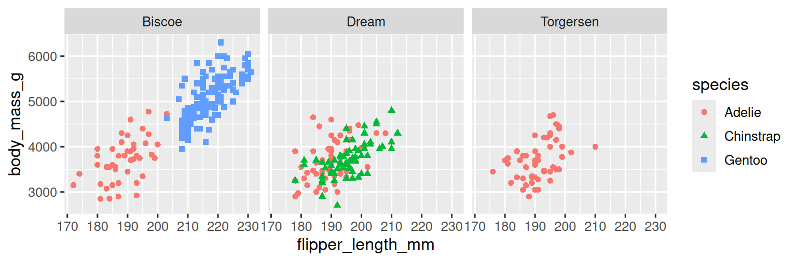

شما در فصل 9 با بسیاری از geomهای دیگر برای تصویرسازی توزیع متغیرها و روابط بین آنها آشنا خواهید شد.

### 5.5.1 تمرین‌ها

1. چارچوب داده ‍`mpg` که همراه با بسته ggplot2 ارائه می‌شود، شامل ۲۳۴ مشاهده است که توسط آژانس حفاظت از محیط زیست ایالات متحده روی ۳۸ مدل خودرو جمع‌آوری شده است. کدام متغیرها در `mpg` رسته‌ای هستند؟ کدام متغیرها عددی هستند؟ (راهنمایی: برای خواندن راهنمای مجموعه داده، `mpg?`را تایپ کنید.) چگونه می‌توانید این اطلاعات را هنگام اجرای `mpg` مشاهده کنید؟
2. با استفاده از چارچوب داده `mpg`، یک نمودار پراکنش از `hwy` در مقابل `displ` ایجاد کنید. سپس، یک متغیر عددی سوم را به `color`، سپس به `size`، سپس هم به `color` و هم به `size` و در نهایت به `shape` اختصاص دهید. چگونه این آرگومان‌ها برای متغیرهای رسته‌ای در مقابل متغیرهای عددی متفاوت رفتار می‌کنند؟
3. در نمودار پراکنش ‍‍`hwy` در مقابل `displ`، اگر متغیر سوم را به آرگومان `linewidth` اختصاص دهید، چه اتفاقی می‌افتد؟
4. اگر یک متغیر مشابه را به چندین آرگومان اختصاص دهید چه اتفاقی می‌افتد؟
5. یک نمودار پراکنش از `bill_depth_mm` در مقابل `bill_length_mm` ایجاد کنید و نقاط را بر اساس `species` رنگ کنید. اضافه کردن رنگ‌آمیزی بر اساس گونه‌ها چه چیزی را در مورد رابطه بین این دو متغیر آشکار می‌کند؟ در مورد وجه‌بندی بر اساس `species` چطور؟
6. چرا دستور زیر دو شرح راهنمای جداگانه ارائه می‌دهد؟ چگونه می‌توانید این مشکل را حل کنید تا دو راهنما با هم ترکیب شوند؟

```{r}
ggplot(
  data = penguins,
  mapping = aes(
    x = bill_length_mm, y = bill_depth_mm, 
    color = species, shape = species
  )
) +
  geom_point() +
  labs(color = "Species")
```

7. دو نمودار میله‌ای پشته‌ای زیر را رسم کنید. کدام سوال را می‌توانید با نمودار اول پاسخ دهید؟ کدام سوال را می‌توانید با نمودار دوم پاسخ دهید؟

```{r}
ggplot(penguins, aes(x = island, fill = species)) +
  geom_bar(position = "fill")
ggplot(penguins, aes(x = species, fill = island)) +
  geom_bar(position = "fill")
```


## ذخیره نمودارها

پس از اینکه نمودار خود را ساختید، احتمالاً می‌خواهید آن را خارج از R به عنوان یک تصویر که می‌توانید در جای دیگری استفاده کنید، ذخیره کنید. این کار با `()ggsave` انجام می‌شود.


```{r}
ggplot(penguins, aes(x = flipper_length_mm, y = body_mass_g)) +
  geom_point()
ggsave("penguin-plot.png")
```

این کار نمودار شما را در مسیر کاری‌تان ذخیره می‌کند، مفهومی که در فصل 6 بیشتر با آن آشنا خواهید شد. 

اگر `width` و `height` را مشخص نکنید، آنها از ابعاد دستگاه رسم فعلی گرفته می‌شوند. برای بازتولید نمودار، باید آنها را مشخص کنید. می‌توانید در راهنمای تابع درباره `()ggsave` اطلاعات بیشتری کسب کنید.

با این حال، به طور کلی توصیه می‌کنیم گزارش‌های نهایی خود را با استفاده از Quarto، یک سیستم نگارش قابل تکرار که به شما امکان می‌دهد کد و متن خود را در هم ادغام کنید و به طور خودکار نمودارهای خود را در نوشته‌هایتان بگنجانید، انجام دهید. در فصل ۲۸ درباره Quarto بیشتر یاد خواهید گرفت.

### 1.6.1 تمرین‌ها

1. خطوط کد زیر را اجرا کنید. کدام یک از دو نمودار با نام `mpg-plot.png` ذخیره می‌شود؟ چرا؟

```{r}
ggplot(mpg, aes(x = class)) +
  geom_bar()
ggplot(mpg, aes(x = cty, y = hwy)) +
  geom_point()
ggsave("mpg-plot.png")
```

2. برای ذخیره نمودار به صورت PDF به جای PNG، چه تغییری در کد بالا باید ایجاد کنید؟ چگونه می‌توانید بفهمید که چه نوع فایل‌های تصویری در `()ggsave` کار می‌کنند؟


## 7.1 مشکلات رایج

همانطور که شروع به اجرای کد R می‌کنید، احتمالاً با مشکلات روبرو خواهید شد. نگران نباشید - این برای همه اتفاق می‌افتد. همه ما سال‌هاست که کد R می‌نویسیم، اما هر روز هنوز کدی می‌نویسیم که در اولین تلاش کار نمی‌کند!

با مقایسه دقیق کدی که اجرا می‌کنید با کد موجود در کتاب شروع کنید. زبان برنامه‌نویسی R بسیار سخت‌گیر است و یک کاراکتر نامناسب می‌تواند تفاوت زیادی ایجاد کند. مطمئن شوید که هر  `)` با یک `(` و هر `"` با `"` دیگری جفت شده باشد. گاهی اوقات کد را اجرا می‌کنید و هیچ اتفاقی نمی‌افتد. سمت چپ کنسول خود را بررسی کنید: اگر علامت `+` باشد، به این معنی است که R فکر نمی‌کند شما یک عبارت کامل را تایپ کرده باشید و منتظر می‌ماند تا آن را تمام کنید. در این حالت، معمولاً به راحتی می‌توانید با فشار دادن ESCAPE برای عدم اجرای دستور فعلی، دوباره از ابتدا شروع کرد.

یکی از مشکلات رایج هنگام ایجاد نمودارهای ggplot2 این است که `+` را در جای اشتباه قرار دهید: باید در انتهای خط بیاید، نه در ابتدا. به عبارت دیگر، مطمئن شوید که به طور تصادفی کدی مانند این ننوشته‌اید:

```{r}
ggplot(data = mpg) 
+ geom_point(mapping = aes(x = displ, y = hwy))
```

اگر هنوز گیر کرده‌اید، از راهنما استفاده کنید. شما می‌توانید با اجرای `function_name?` در کنسول، یا برجسته کردن نام تابع و فشردن کلید F1 در RStudio، در مورد هر تابع R راهنمایی دریافت کنید. اگر کمک چندان مفید به نظر نمی‌رسد، نگران نباشید - در عوض به مثال‌ها بروید و به دنبال کدی باشید که با کاری که می‌خواهید انجام دهید مطابقت داشته باشد.

اگر این کمکی نکرد، پیام خطا را با دقت بخوانید. گاهی اوقات پاسخ در آنجا پنهان شده است! اما وقتی در R تازه‌کار هستید، حتی اگر پاسخ در پیام خطا باشد، ممکن است هنوز ندانید چگونه آن را بفهمید. ابزار عالی دیگر گوگل است: پیام خطا را در گوگل جستجو کنید، زیرا احتمالاً شخص دیگری نیز همین مشکل را داشته و به صورت آنلاین کمک گرفته است.


## 8.1 خلاصه

در این فصل، اصول اولیه تصویرسازی داده با ggplot2 را آموختید.  ما با ایده اولیه‌ای که زیربنای ggplot2 است شروع کردیم: تصویرسازی، نگاشتی از متغیرهای داده‌های شما به ویژگی‌های زیبایی‌شناختی نمودار مانند موقعیت، رنگ، اندازه و شکل است. سپس در مورد افزایش پیچیدگی و بهبود ارائه نمودارهای خود به صورت لایه به لایه آموختید. همچنین در مورد نمودارهای رایج برای تصویرسازی توزیع یک متغیر واحد و همچنین برای تصویرسازی روابط بین دو یا چند متغیر، با استفاده از نگاشت‌های زیبایی‌شناختی اضافی و/یا تقسیم نمودار خود به چند متغیر کوچک با استفاده از وجه‌بندی، آموختید.

ما در طول این کتاب بارها و بارها از تصویرسازی استفاده خواهیم کرد و در صورت نیاز، تکنیک‌های جدیدی را معرفی خواهیم کرد و همچنین در فصل‌های 9 تا 11 نگاهی عمیق‌تر به ایجاد تصویرسازی‌ها با ggplot2 خواهیم داشت.

با آشنایی با اصول اولیه تصویرسازی، در فصل بعدی کمی تغییر رویه خواهیم داد و توصیه‌های عملی در مورد گردش کار به شما ارائه خواهیم داد. ما در این بخش از کتاب، توصیه‌های مربوط به گردش کار را با ابزارهای علم داده ترکیب کرده‌ایم، زیرا به شما کمک می‌کند تا با افزایش حجم کد R، سازماندهی خود را حفظ کنید.
